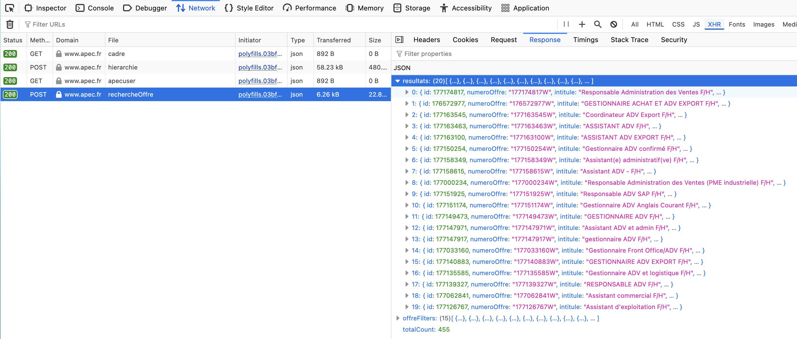
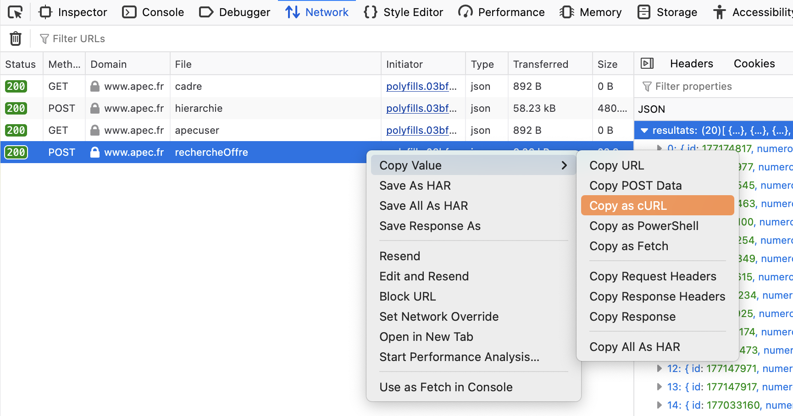

# Let's find job offers

This is a personal project to explore web scraping, data retrieval, data processing and LLM integration.

The project's goals are to get an automated way of finding new job offers, use different methods to scrape data, use LLM for information extraction and check if it is reliable.

- Discover the scraping library **Crawl4AI**
- Use **LangChain** and **Pydantic** to monitor and validate the LLM's output
- Use the amazing **Polars** expressions

We will extract data from the web using 2 approaches:
- web scraping 
- API reverse engineering

We will process and extract the data from the offers with 2 approaches: 
- with an LLM
- with traditional string manipulation

### Libraries:

- **[Crawl4AI](https://github.com/unclecode/crawl4ai)** for web scraping 
- **[LangChain](https://www.langchain.com/langchain)** and **[Pydantic](https://docs.pydantic.dev/latest/why/)** to set up the LLM and validate its output
- **[Polars](https://github.com/pola-rs/polars)** for data manipulation using DataFrames and modern syntax

#### Prerequisites

**Environment**

- **Python 3.11+**  
- **Crawl4AI** for web scraping  
- **LangChain** and **Pydantic** for LLM integration and output validation  
- **Polars** for data manipulation 
- **Ollama** to run LLM locally  

**Hardware**

- A machine with a GPU or a modern laptop with an integrated GPU (e.g. Apple Silicon M1pro).  
- 16 GB of RAM.

**Knowledge**

- Basic Python (scripting, data processing).  
- Interest for web scrapping.  
- Understanding of LLMs (prompt engineering, structured outputs).  

> *The ultimate goal of the project is to learn and practice.*

# Methodology

## Data sources

We extract data from 2 different websites:

[🌐 Choisir le service public](https://choisirleservicepublic.gouv.fr/): Official French public service job platform.

[🌐 APEC](https://www.apec.fr/): French organization supporting white-collar workers in their career transitions and professional development. It is also a job offer platform.

We used a different approach for each:
- web scraping: with CSS selectors (**Choisir le service public**)
- By reverse-engineering the website's hidden API to access the data directly (**APEC**)

## Extracting Data from the Web

### Approach 1: Web scraping

Web scraping is about extracting information from a web page. 
Different techniques exist and the output is a mix of the targeted data and unwanted elements or informations.  
This requires processing the output to keep only the useful information and to have a formatted structured output, ready to be used.

2-step scraping: 

1. extract links from a search page.  
2. extract the content of the page for each link.

Crawl4AI produces a nice output in markdown format, perfect to ingest into an LLM and has convenient functions to filter the content.

We used CSS selectors to focus the scraper.
This allowed extracting the desired content with limited noise to remove later.

### Approach 2: API reverse engineering

The concept is to analyze the HTTP requests and responses exchanged between the web browser and the server. This is easy to do with the browser's devtools **network panel**.

This approach required me to understand how web browsers and the web work and I briefly detailed what I learned in the [Analysis](#analysis) section.

The **browser's devtools** network panel shows in real time all the requests and responses that occur since the page was loaded. We can explore the requests and find the ones that contain data. We have to test the APIs, understand their purpose, maybe the interactions between the different APIs, because there is no documentation to help us for those hidden APIs.

The goal is to have a command with the right filters, to get only the data we want from the API. The devtools allow us to copy as a cURL command the requests of the panel and this is the info we need to build a [**POST**](https://developer.mozilla.org/en-US/docs/Web/HTTP/Reference/Methods/POST) request to use in Python with the **requests module**. We could also have stuck to the command line and with minimal shell scripting achieve the same result. It's only for personal preferences that I used Python since using the command line is usually more straightforward to implement and faster.

If the API is straightforward, visible in the network traffic and has minimal authentication, finding the elements we need is very easy.

Here is the **POST** request that contains our data and to the right the **Response** panel indeed shows the data.  
  

Getting the cURL command is as easy as that:  
  


Furthermore, JSON is the standard data format for web content mainly for its compatibility with JavaScript and for its simplicity/lightweight nature. This is important to us because the extracted data is already in the format we want it in.

Another benefit of this approach is skipping the web browser entirely from the extraction process. Since we request the server directly using an API. We save time, we don't have to deal with HTML code or scraping waste, and it's simpler to implement.

>DISCLAIMER:
>
>This is not illegal: we only access the data provided in the web page using a *public API*.   
>Nevertheless, we have to respect the API's owner and not overwhelm their infrastructure and follow the **robots.txt** guidelines. In our case we do a call to get the data for each web page but it's no different from loading a web page with the web browser so our usage of the API is very small.

## Data processing

Scraped data is processed twice to obtain the same result to compare both solutions:

1. With an **LLM**:

Asking it to extract the content of the job offer and fill a structured JSON with a defined schema. The job offer input will be a markdown document, direct output from the web scraping.

To work with LLMs we need: 

- a tool to download and manage LLMs on our machine: **[Ollama](https://ollama.com)** is an open source project to work with LLMs locally.

- local hardware: Since the Apple Silicon chips, MacBooks can run smaller LLMs with very good speed, efficiency and performance. All together we have a solution that is free, only limited by the hardware and offline. 

- software to work with LLM: **LangChain** is the reference and **Pydantic** is now also the reference when working with LLM. When using those 2 libraries, we can build a chain that uses an LLM and that will produce a structured output that will be validated with Pydantic.

2. With **traditional string manipulation** 

Our inputs are markdown files that are basically structured text, therefore using string manipulations and regex patterns, we can shape them to be a structured output.

We will use DataFrames for efficient processing and **Polars** provides a great API to work with strings and DataFrames. 

We will have a tidy DataFrame with a row for each job offer, and a column for each information we want to extract. This way we can do the same transformations on all the offers easily and at the same time.

Polars is great because it has a whole API to process strings of text (Series in Polars) with ***expressions***. The expressions allow performing operations on columns or rows in an optimized and vectorized way. They can be seen as custom functions since they can be crafted, named, and be used multiple times on different data. We build an expression with a precise purpose. 

We can then create a pipeline that uses the expressions.

For example: Instead of a single block of code that chains 20 actions, we have a block that uses 4 expressions of 5 actions, that are named after what they do. Our pipeline can almost be read like a sentence.   
This approach also limits the number of intermediate outputs that load the RAM and makes the code much harder to maintain.  
Expressions also allow Polars to evaluate the code before running it, allowing for optimization for faster and more efficient code.

To sum up, we have cleaner, optimized and efficient code, that is easier to understand and to maintain.


I'm already familiar with traditional string manipulation and know it would work. We will see if the LLM can be a solution as well, both outputs will be in JSON format for easy comparison.

### Model selection

Choosing the right model can be a complicated task.  
I wanted to use a small LLM that could run **locally** on my machine to have a **free**, **low resources** and **offline** solution. I used Ollama with an M1 Pro MacBook.  
I selected the model [**qwen2.5:3b**](https://ollama.com/library/qwen2.5) mainly because it supports JSON outputs and has a big context window.  
(Under Apache 2.0 license)

Choosing the right model can be a complicated task and testing many models takes time and resources. I decided to select a model that had good results with no optimizations and tried to improve from there.  
It is also important to define what we want the model to do and how.

In this project we use the LLM for **content extraction** and it is particularly suited because:
- 100% of the content to extract is in the input
- the input is well structured with markdown headers
- the input is <10K characters (≈ 2200 tokens + prompt, far from the 128K tokens context limit of the model)

# Results

### Web scraping outcomes:

Link extraction: 
- direct JSON output, single file
- 1 important key "**href**", contains the direct link to a job offer.
- One object for each link

Job offer extraction:
- one markdown file for each job offer
- only text and markdown syntax
- clean output, all the offer's text is extracted
- few irrelevant elements that are the titles of JavaScript interactive elements like "Afficher la suite" (to show hidden content) or "Flèche gauche, Flèche droite" (integrated map navigation arrows)
- Almost like a markdown version of the HTML

The extraction is a success because all the content is accessible and with almost only relevant content so no more cleaning is needed for the next step.

### API bypass outcomes:

The request output is a JSON file with 2 objects:
- **resultats**: job offer information
- **totalCount**: total number of offers found

The request asks for 20 objects from the first page to limit the amount of data.
```json
"pagination": {"range": 20, "startIndex": 0},
```  


The file has the following keys:
- id
- intitule (offer's title)
- lieuTexte (location)
- salaireTexte (salary)
- texteOffre (offer's description, mission, profile etc...)
- datePublication (publication date)
- typeContrat (contract type, fixed or permanent)
- contractDuration (contract's duration)
- url  

### LLM performance:

- The model was able to process the markdown files and return a valid JSON output.
- It took between 25s and 60s to process a file
- The hardware handled it fine and the RAM pressure was kept in the green, meaning that some remained free.

### Polars processing:

- The script runs very fast and produces the desired output
- The script adapts to each file and processes it correctly regarding its specificities in the markdown headers
- Extracts all the content for all the possible keys
- Output is in CSV and/or JSON

### Comparison between Polars and LLM results:

Execution time :
- LLM: ~10 minutes (16 files, 25s-60s per file)
- Polars: 0.04s

To compare the differences between the LLM's output and Polars's output, I used *git diff* on JSON files. I selected the offer_3 that showcases most of the differences.  
**White text** is present in **both**.  
**Green text** is only present in the **LLM's output**  
**Red text** is only present in the **Polars's output**  

Let's detail the git diff.  

**1.** Content is the same for both as well as small differences that don't have a major impact on the meaning.  
  

**2.** Major issues from the LLM: missing blocks of content from the bigger sections: Missions. The big red part is not found in the LLM output.  
   
 
**3.** the LLM sometimes simplifies the information and thus misses some of the content.   
  

This is a particularly bad example of the LLM failures. In most offers, the differences are in small words or sentences that are slightly different or punctuation.

# Analysis

### Why Pydantic is Essential to our codebase

**Pydantic's validation is a gatekeeper:**  
It transforms, validates and sanitizes all incoming data.
- **Transforms** - Converts raw data types into proper Python objects (e.g. here it's JSON data types)
- **Validates** - Checks that data meets defined rules and constraints (e.g. number is within valid range, required fields are present). All validation rules are declaratively defined in the Pydantic models  
- **Sanitizes** - Cleans and normalizes data to remove undefined fields or potential issues (e.g., strips whitespace, ensures consistent formatting, deal with null values)  

**Key benefits:**  
This prevent entire classes of bugs and data corruption issues.
Furthermore, everything is defined in the model(s) so it's easy to undertand, modify, update and document.  
We also don't have to write cumbersome data validation code.  

We use Pydantic for the LLM twice:

- create the structured output schema for the LLM to follow (it's just a pydantic model). It helps substantially the LLM.
- to validate the LLM's output  

### How browsers work:

The **web browser** is the core application of modern web browsing. It is the gateway to the internet for 99% of people and is one of the elements that makes the modern web. It is also the most used application on computers and nowadays almost everything can be done on the internet therefore with a web browser.

Web pages are built from multiple components that work together. 
- **HTML** provides the structure
- **CSS** files define the visual styling (how the page looks)
- **JavaScript** files add interactivity and dynamic behavior. 
- more static resources like images.

HTML and CSS are static. They load quickly and provide the visual foundation. JavaScript is dynamic. It enables all the interactive features and real-time content updates that make modern websites.

When a user accesses a website:

1. Browser requests the page: Sends a **GET request** to the server
2. Server responds with HTML: Returns the basic page structure (often empty) and links to other resources
3. Browser downloads resources: Fetches CSS files, JavaScript files, and images in parallel
4. Browser renders the page: Applies CSS styling to create the visual layout
5. JavaScript executes: Runs code that makes API calls to fetch actual data
6. Dynamic content loads: JavaScript processes API responses and populates the empty page with real content
7. Page becomes fully interactive with all the dynamic features

If we use the **browser's devtools** network panel, we can inspect the traffic between the browser and the server.

If the API is straightforward, visible in the network traffic and has minimal authentication, we can extract the request as a cURL command using the devtools.

We can use the elements of the cURL command to create a Python script to extract the data we want in the format we want. (Although this could be even more straightforward (and simpler) with command line scripting, but as a data scientist, I love Python and will use it)

When using a web browser we **have to** access the web through the browser interface. While this makes the web usable for the majority of people, it is a constraint when the goal is simply to catch and store the content in a file. In this approach we bypass the browser part to access the data directly.

With a web browser:

**Browser → HTML → JavaScript → API call → Data → Populate page**

With bypass:

**Script → API call → Data (same data)**


✅ **Pros**: 
- fast execution
- access directly the data as **structured output**
- no scraping to do
- significantly easier and faster to implement compared to a scraping pipeline

❌ **Cons:**
- not always possible (authentication and security)
- needs maintenance: the API can change
- can be challenging to find the right API call that delivers the right data

### LLM evaluation: failure patterns, pros and cons

✅ **Pros**: 
- Excellent for the extraction of multiple, well defined, short content
- Easier and faster to implement
- code is overall easy to understand
- larger (small) models would be better at this task

❌ **Cons**: 
- requires understanding how the LLM will handle the task and some tests and retries
- requires hardware
- potential unexpected output or behaviour

I tested different small models of different sizes and here are my observations:

In very rare cases the LLM changes small words but with no impact on the meaning of the text
- If a section is long, the LLM can stop and ignore the rest
- Some words are misinterpreted as section titles
- Some words are misinterpreted as being in another section's title, or in a different context from the previous lines, causing the model to ignore the rest of the text. I couldn't fix this behavior with prompt engineering.
- Some models hallucinated part of the output despite the temperature being 0, and the prompt emphasizing to absolutely not do that.
- Bigger models (~7b params) didn't produce better results. I couldn't test the biggest of 'small models' (~30b params), but I suspect them to perform much better
- LLM took between 24s and 60s to process a document

My takes on why the LLM fails:
- **Generation constraints**: the model failing regarding the size of the document might imply that the issue is not the document size but the total output length
- **Context processing limits**: the model might not catch all the context, be confused by or misinterpret some elements as section titles or boundaries
- **Instruction compliance**: the model rewrote some words and did hallucinate some sentences when similar elements were found in other parts of the document. I interpreted it as the model 'merging' all the close information under a single key.

We find here 3 caveats of small LLMs. We observe the limitations of the model itself. It is probably possible to improve my results further but the better answer to this is probably to use a larger model.

**Conclusion on the LLM:**

- The model ran perfectly well with no RAM pressure on my machine and managed to do the work as intended
- Preprocessing steps on the input are mandatory to remove elements that would confuse the model
- The model failed to extract all content for some job offers, usually for longer sections (missions, profile). The model missed the last sentence of long paragraphs more than any other mistake.
- Even if the model is not 100% reliable, the extracted content is enough to explore the job offer and build a database.
- The prompt played a smaller role than expected. The minimalist prompt 'extract the content' performs very well despite lack of detailed instructions but with more errors like summarizations. The Pydantic model is probably more important than the prompt.
- LLM performs extremely well on extraction of smaller content at convenient speed.
- The small nature of the model is likely a major issue if the objectif is a perfect result

### String manipulation evaluation: Polars expressions approach

✅ **Pros:**
- deterministic, reliable
- very fast execution
- works with minimal resources

❌ **Cons:** 
- longer to set up
- needs problem solving skills and good logic
- need to analyze and understand the challenges of the content to treat all the possible cases
- complex code that is harder to maintain and to understand. The accumulation of unique cases or conditions to take into account can worsen this.  

Polars expressions are meant to work with DataFrames.

```python
remove_noise_and_whitespaces = (
    pl.all()
    .str.strip_chars()
    .str.replace_all(
        r"^(.*?)\n", value=""
    )  # remove first line if it ends with a \n (it removes the headers artifacts)
)
```

Let's break it down:
- The expression's name should inform what it does --> It removes unwanted content as well as whitespaces.
- ```pl.all()``` selects all the variables of the dataset
- ```str.strip_chars()``` removes leading and trailing whitespaces from the string values
- ```.str.replace_all(r"^(.*?)\n", value="")``` replaces a match pattern with a value.  
Since we replace with nothing, we remove the element.  
What we want to remove is given by the *regex* pattern "^(.*?)\n". Let's break it down:
**^** means the start of the string
The parentheses **()** declare a capture group
**.** means any character except a newline
**\*** is a quantifier, * means 0 or more
**?** this makes the quantifier non-greedy so we match as few as possible until the pattern is satisfied.
**\n** is a newline character.

We can express this regex as a sentence:  
- From the start of the line, match any character until it encounters a newline character. The pattern will stop at the first newline character found after the pattern, rather than going to the *last* newline character it can find.

In practice, this pattern is used to extract the first line of a string. In my case, the first line was the markdown header and I didn't want the header in the content since the variable name already had the information.
- ```.str.replace_all(r"\n", value=" ")``` replaces the newline characters with a blank space. This effectively makes the content a single line.

Going back to the expression's name:
- It removes noise (markdown headers that are the first lines of the strings)
- It removes whitespaces
- It makes the document a single line 

This expression was built with a specific DataFrame in mind. But it can be reused on another dataset as long as it matches the expression's actions.  
For example, I could do my processing again on other job offers and instead of rewriting the code, like with a function, I can call the expression on my dataset.  

Now let's see the different expressions in the final pipeline and why it can be a cleaner way to write code.

```python
    final_df = (
        wip.with_columns(concat_expressions)
        .rename(
            {
                "Vos missions en quelques mots": "missions",
                "Statut du poste": "job_status",
                "Métier de référence": "profession",
                **(
                    {"Descriptif du service": "employeur_description"}
                    if "Descriptif du service" in available_cols
                    else {}
                ),
            }
        )
        .select(remove_noise_and_whitespaces)
        .select(cs.by_name(*FINAL_COLUMNS, require_all=False))
    )

    return final_df
```

The pipeline uses 3 external elements:
- 1 Polars expression (remove_noise_and_whitespaces)
- 1 list of Polars expressions (concat_expressions)
- 1 list (FINAL_COLUMNS)

**1.** The pipeline uses the list of Polars expressions, essentially applying to the DataFrame n expressions one after the other (this list of expressions is my solution to the unpredictable header structure/organization of the job offers).  
**2.** It renames some variables using the rename function with a dynamic dictionary to handle a specific case.  
**3.** It uses the expression *remove noise and whitespaces* to do what it says.  
**4.** It filters the DataFrame to keep only a subset of variables that are specified in the list *FINAL_COLUMNS*. *require_all=False* basically allows the code to work even if the variable is missing which was the case with different structures of job offers.  
**5** We return a Polars DataFrame.  

This pipeline regroups ALL the concrete actions that modify the dataset, the code before that is only setup.  
Each step is clear and has a defined purpose.  
This pipeline takes 'wip' (DataFrame) as input and creates 'final_df' (DataFrame) as output. 
Instead of creating 4 intermediate DataFrames, we created expressions that do nothing unless used, like functions.  
We chained the methods for an all-in-one, easy to read and clear code block.

**Why not Pandas?**  

The answer lies in the design philosophy of both libraries.  
In Pandas, we can also use method chaining, in fact, my pipeline would be very similar in Pandas with mostly the same code with different function names.  
But it is less common and not the standard for a few reasons:
- Pandas is **eager**. Each operation is evaluated immediately, which makes method chaining harder code to debug and possible performance overhead since the output of each step is created, and reused for the next one, even if we didn't declare those intermediate datasets. With large datasets this is a real issue.
- **Harder to debug** and to understand. Since we don't create intermediate results, we can't easily inspect those results. This means that it is harder to maintain.  
- To fit better the eager execution, Pandas works best with intermediate results.  

**Why Polars is better at method chaining?**  
- Polars has lazy execution, this allows for query optimizations. The entire pipeline is optimized with the Polars query optimizer and thus reduces redundant computations and improves performance. Game changer for large datasets.
- Polars encourages a declarative style of programming, where we describe what we want to do rather than how to do it. It fits better method chaining as it allows expressing complex transformations concisely.
- Polars is a newer library, written in Rust and optimized for performance, with method chaining being a fundamental part of Polars' design.

My dataset is very small so eager vs lazy doesn't make a difference, so using Pandas would have been as effective as Polars, but the code is better written in Polars in my opinion and it would be easier to adapt for huge datasets since we would only have to switch to the lazy API which is very easy to do. 

### When to use each approach  

String manipulation done right returns what the user wants and allows for (unlimited) flexibility.  
LLMs have limitations and will always have a part of randomness in their output (even if this randomness has no impact).  

Use LLM for content extraction:
- when the content to extract is small and easy to identify
- when the output is structured
- when the extracted content needs simple processing (summarization, translation, re-organization)
- when a complex task can be decomposed into smaller, simpler ones for multiple LLMs to work together
- when the hardware allows for larger models

Use traditional techniques:
- when the content to process is huge. Either big files, or big groups of small files
- when speed is a primary concern. When the execution has to be fast/optimized
- when robustness is a primary concern. LLMs are still black boxes that have unexpected behaviors, whereas Python code can be rooted to the C implementations if it is ever needed to have a complete understanding of how the machine acts. 

### Lessons learned: Model behavior insights, preprocessing importance

Small LLMs are harder to 'control' and are much more sensitive to the input. If the task is a bit complex like in my use case, the model's behavior can be hard to understand and to debug.  
Content structure, punctuation, keywords, are all elements that influence how the model will understand the text.  
Removing those can help the model. I made this assumption because it worked for the majority of my files, but it can also worsen the performance. It comes down to the input itself and the model used. Each model has potentially different behavior.


# Conclusions

In this project I learned about:
- **web scraping**, about 2 approaches among many and about good practices.
- **content extraction from documents**, and structured outputs
- **LLMs** (small LLMs) as tools in their integration in a workflow and a data pipeline
- **new Python libraries**, to work with AI (LangChain, Pydantic), to extract content from the web (Crawl4AI), to manipulate data as DataFrames (Polars)
- **project management** and organization

The project is successful.  
We managed to extract and process data from the web while testing different techniques for the extraction and the processing. We explored the pros and cons for each method and got a better idea of when to use each and why.  
The results prove my intuitions to be wrong. I thought that the LLM would be better at handling the content and that my help (the prompt, the preprocessing), could fix most of the issues. I also thought that using a smaller LLM would be an advantage, that the model being simpler would tend to stay closer to the actual content and not try to prove it is smart. It turns out that it is the opposite because we trade robustness and capabilities for size and RAM usage.  

The project could be extended with a visualization tool of the dataset to explore the job offers content in a better way.  
This project could be further with the addition of tests, more monitoring and evaluation of the code. We could have a number for the Polars's actual performance on the content extraction, a number on the misses of the LLM. We could have small descriptive statistics at the offer level or at the global level to understand and assess better which approach is better and why.

This project could be further improved by: 
- adding tests, more monitoring and evaluation of the code. 
- quantitative metric for the Polars's actual performance on the content extraction
- quantitative metric on the misses of the LLM
- descriptive statistics at the offer level or at the global level to understand and assess better which approach performs best.


---